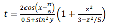
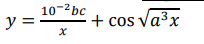

# Практическая работа 4

## Дисциплина
Программирование (C#, WPF)

## Тема
Разработка приложения WPF с ручным тестированием методом "белого ящика"

## Цель работы
Приобрести практические навыки ручного тестирования методом "белого ящика" при разработке WPF-приложений.

## Разработчики
- Корж 523
- Черненькая 523

## Вариант задания: 1

### Страница 1
Функция: t = (2cos(x-π/6))/(0.5+sin²y) · (1 + z²/(3-z²/5))

### Страница 2
Функция с условиями:
- a = (f(x)+y)² - √(f(x)y), при xy > 0
- a = (f(x)+y)² + √(|f(x)y|), при xy < 0
- a = (f(x)+y)² + 1, при xy = 0

Выбор f(x): sh(x), x², eˣ

### Страница 3
Табуляция функции: y = (10⁻²·b·c)/x + cos(√(a³·x))

Параметры: a, b, c, x₀, xₖ, dx

## Стек технологий
- Язык программирования: C#
- Платформа: .NET Framework
- Технология: WPF
- Библиотека для графиков: LiveCharts.Wpf
- Среда разработки: Visual Studio
- Система контроля версий: Git

## Архитектура приложения
Приложение состоит из главного окна и трех страниц:

1. **MainWindow** - главное окно с меню для навигации между страницами
2. **Page1** - расчет первой функции
3. **Page2** - расчет функции с выбором варианта f(x)
4. **Page3** - табуляция функции с построением графика

## Функциональность
- Проверка полей ввода на корректность
- Всплывающие подсказки для всех элементов управления
- Блокировка полей результатов от редактирования
- Подтверждение выхода из приложения
- Построение графиков с помощью LiveCharts

## Инструкция по запуску
1. Склонировать репозиторий
2. Открыть решение Pr4.sln в Visual Studio
3. Восстановить пакеты NuGet (LiveCharts.Wpf)
4. Собрать проект
5. Запустить приложение

## Ссылка на репозиторий
https://github.com/Korzh7/ISIP523_Korzh_SupTest