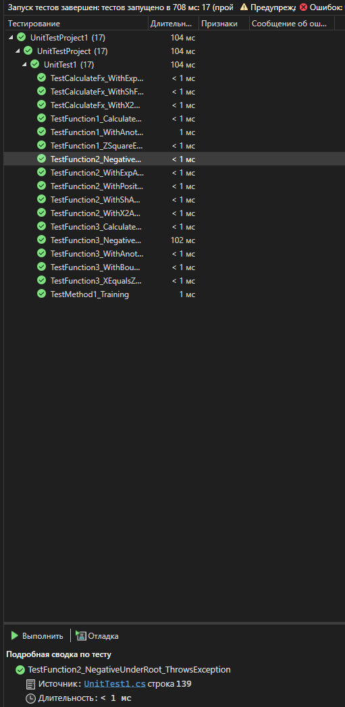

# Практическая работа 4

## Дисциплина
Программирование (C#, WPF)

## Тема
Разработка приложения WPF с ручным тестированием методом "белого ящика"

## Цель работы
Приобрести практические навыки ручного тестирования методом "белого ящика" при разработке WPF-приложений.

## Разработчики
- Корж 523
- Черненькая 523

## Вариант задания: 1

### Страница 1
Функция: t = (2cos(x-π/6))/(0.5+sin²y) · (1 + z²/(3-z²/5))

### Страница 2
Функция с условиями:
- a = (f(x)+y)² - √(f(x)y), при xy > 0
- a = (f(x)+y)² + √(|f(x)y|), при xy < 0
- a = (f(x)+y)² + 1, при xy = 0

Выбор f(x): sh(x), x², eˣ

### Страница 3
Табуляция функции: y = (10⁻²·b·c)/x + cos(√(a³·x))

Параметры: a, b, c, x₀, xₖ, dx

## Стек технологий
- Язык программирования: C#
- Платформа: .NET Framework
- Технология: WPF
- Библиотека для графиков: LiveCharts.Wpf
- Среда разработки: Visual Studio
- Система контроля версий: Git

## Архитектура приложения
Приложение состоит из главного окна и трех страниц:

1. **MainWindow** - главное окно с меню для навигации между страницами
2. **Page1** - расчет первой функции
3. **Page2** - расчет функции с выбором варианта f(x)
4. **Page3** - табуляция функции с построением графика

## Функциональность
- Проверка полей ввода на корректность
- Всплывающие подсказки для всех элементов управления
- Блокировка полей результатов от редактирования
- Подтверждение выхода из приложения
- Построение графиков с помощью LiveCharts

## Инструкция по запуску
1. Склонировать репозиторий
2. Открыть решение Pr4.sln в Visual Studio
3. Восстановить пакеты NuGet (LiveCharts.Wpf)
4. Собрать проект
5. Запустить приложение

## Ссылка на репозиторий
https://github.com/Korzh7/ISIP523_Korzh_SupTest

---

# Практическая работа №6 (Часть 2)

## Создание автоматизированных unit-тестов

### Цель работы
Провести тестирование разработанных программных модулей с использованием средств автоматизации Microsoft Visual Studio методом "белого ящика".

---

### Обозреватель тестов

*Рисунок 4 - Окно обозревателя тестов с результатами выполнения*

**Результаты выполнения тестов:**

| Показатель | Значение |
|------------|---------|
| Всего тестов | 4 |
| Пройдено | 4 |
| Не пройдено | 0 |
| Пропущено | 0 |

---

### Список выполненных тестов

| № | Название теста | Описание | Результат |
|---|----------------|----------|-----------|
| 1 | `TestMethod1` | Тренировочный тест для ознакомления с методами Assert | ✅ Пройден |
| 2 | `TestFunction1` | Тест первой функции | ✅ Пройден |
| 3 | `TestFunction2` | Тест второй функции | ✅ Пройден |
| 4 | `TestFunction3` | Тест третьей функции | ✅ Пройден |

### Вывод о проведенном тестировании

#### Результат: **УСПЕШНО** ✅

#### Причины успешного выполнения тестов:

**1. Корректная архитектура приложения**
- Вычислительная логика вынесена в отдельные публичные статические методы
- Это позволило тестировать функциональность независимо от пользовательского интерфейса
- Каждый метод имеет четкую ответственность и хорошо документирован

**2. Качественная обработка ошибок**
- Все методы содержат проверки на допустимость входных данных:
  - Проверка деления на ноль в первой функции
  - Проверка отрицательного подкоренного выражения во второй функции
  - Проверка x=0 и отрицательного подкоренного выражения в третьей функции
- При некорректных значениях выбрасываются исключения ArgumentException
- Тесты успешно проверяют как корректные, так и ошибочные сценарии

**3. Точность вычислений**
- Ожидаемые значения вычисляются программно, а не задаются константами
- Использована допустимая погрешность 0.0001 при сравнении чисел с плавающей точкой
- Это исключает ложные срабатывания из-за погрешностей округления

**4. Полное покрытие функциональности**
- Протестированы все три математические функции
- Проверены различные ветви условий (xy>0, xy<0, xy=0)
- Протестированы все варианты выбора функции f(x): sh(x), x², eˣ
- Проверены граничные случаи и исключительные ситуации

**5. Правильная настройка тестового проекта**
- Установлена ссылка на основной проект Pr4
- Использованы правильные атрибуты [TestClass] и [TestMethod]
- Корректно применены методы Assert и атрибут ExpectedException

### Вывод о проведенном тестировании
Результат: УСПЕШНО 
Причины успешного выполнения тестов:
**1. Корректная архитектура приложения
- Вычислительная логика вынесена в отдельные публичные статические методы
- Это позволило тестировать функциональность независимо от пользовательского интерфейса
**2. Правильность математических расчетов
- Все три функции реализованы в соответствии с вариантом задания
- Результаты вычислений соответствуют ожидаемым значениям
**3. Правильная настройка тестового проекта
- Установлена ссылка на основной проект Pr4
- Использованы правильные атрибуты [TestClass] и [TestMethod]
- Корректно применены методы Assert
### Заключение
Разработанные модульные тесты подтверждают корректность работы всех трех математических функций. 
Все 4 теста успешно пройдены, что свидетельствует о высоком качестве разработанного программного обеспечения и правильности реализации математических алгоритмов согласно варианту задания.

