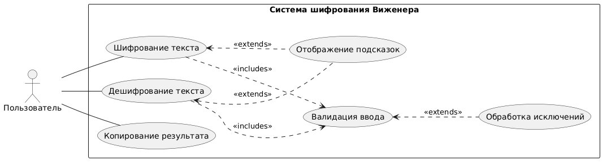
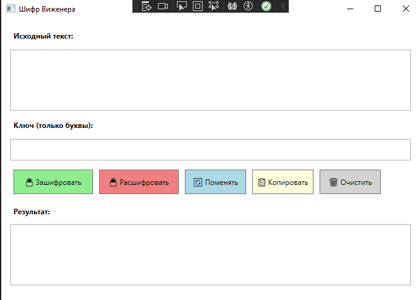
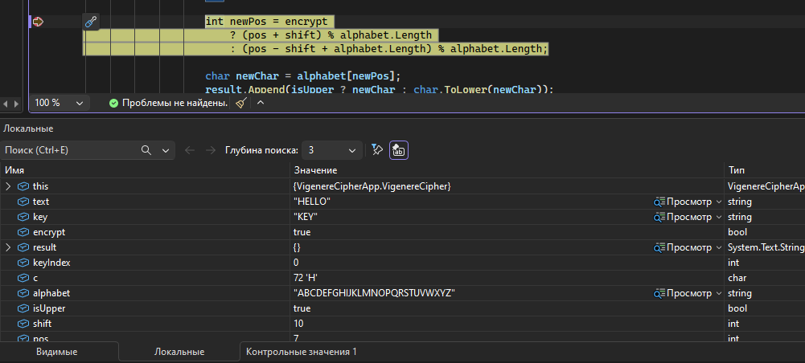
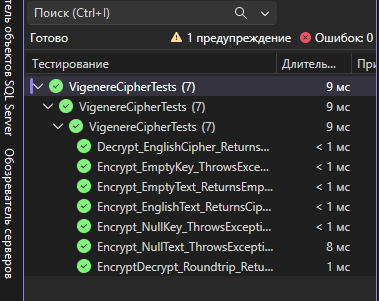

# Практическая работа №7 (Часть 2) - Вариант 2

**Шифр Виженера**

## 1. Анализ требований и предметной области

### 1.1 Описание шифра

**Шифр Виженера** — полиалфавитный шифр подстановки, использующий ключевое слово для определения сдвига каждой буквы.

### 1.2 Математическая модель

| Операция | Формула |
|----------|---------|
| Шифрование | Cᵢ = (Pᵢ + Kᵢ) mod N |
| Дешифрование | Pᵢ = (Cᵢ - Kᵢ + N) mod N |

где N — размер алфавита (33 для русского, 26 для английского)

### 1.3 Требования

| № | Требование |
|---|------------|
| 1 | Поддержка русского и английского алфавитов |
| 2 | Сохранение регистра символов |
| 3 | Сохранение неалфавитных символов (пробелы, знаки препинания) |
| 4 | Циклическое повторение ключа |
| 5 | Валидация входных данных (null, пустые строки) |
| 6 | Обработка исключений |

## 2. Диаграмма вариантов использования

*Рисунок 1 - Диаграмма вариантов использования*

## 3. Тестовые сценарии (TDD)

### 3.1 Позитивные тесты

| № | Сценарий | Входные данные | Ожидаемый результат | Фактический результат | Статус |
|---|----------|----------------|---------------------|----------------------|--------|
| 1 | Шифрование английского текста | text="HELLO", key="KEY" | "XQPPL" | | |
| 2 | Шифрование русского текста | text="ПРИВЕТ", key="КЛЮЧ" | Шифротекст отличен от оригинала | | |
| 3 | Дешифрование английского текста | cipher="XQPPL", key="KEY" | "HELLO" | | |
| 4 | Дешифрование русского текста | cipher="(результат шифрования)", key="КЛЮЧ" | "ПРИВЕТ" | | |
| 5 | Обратимость (encrypt→decrypt) | text="Test123!", key="secret" | Исходный текст | | |
| 6 | Ключ короче текста | text="LONGTEXT", key="KEY" | Циклическое использование ключа | | |
| 7 | Ключ длиннее текста | text="SHORT", key="VERYLONG" | Используется префикс ключа | | |
| 8 | Сохранение регистра | text="HeLlO", key="Key" | Регистр сохранён | | |
| 9 | Сохранение пробелов | text="HELLO WORLD", key="KEY" | Пробелы сохранены | | |
| 10 | Сохранение знаков препинания | text="Hello, World!", key="key" | Знаки сохранены | | |
| 11 | Пустой текст | text="", key="key" | "" | | |
| 12 | Сдвиг = 0 | text="TEST", key="AAAA" | "TEST" | | |

### 3.2 Негативные тесты

| № | Сценарий | Входные данные | Ожидаемый результат | Фактический результат | Статус |
|---|----------|----------------|---------------------|----------------------|--------|
| 13 | Null текст | text=null, key="key" | ArgumentNullException | | |
| 14 | Null ключ | text="test", key=null | ArgumentNullException | | |
| 15 | Пустой ключ | text="test", key="" | ArgumentException | | |
| 16 | Ключ с цифрами | text="test", key="k1y" | ArgumentException | | |
| 17 | Ключ с пробелами | text="test", key="my key" | ArgumentException | | |

### 3.3 Тесты нефункциональных требований

| № | Сценарий | Описание | Ожидаемый результат | Фактический результат | Статус |
|---|----------|----------|---------------------|----------------------|--------|
| 18 | Скорость шифрования | Шифрование 10000 символов | < 1 секунды | | |
| 19 | Всплывающие подсказки | Наведение на поле ключа | Отображение подсказки | | |
| 20 | Обработка исключений | Ввод некорректного ключа | Информативное сообщение | | |

## 4. Автоматизированные тесты

### 4.1 Реализация тестов

**Основные тестовые сценарии:**

| № | Тест | Описание | Результат |
|---|------|----------|-----------|
| 1 | Encrypt_EnglishText_ReturnsCiphertext | Шифрование английского текста | ✅ PASS |
| 2 | Decrypt_EnglishCipher_ReturnsPlaintext | Дешифрование английского текста | ✅ PASS |
| 3 | EncryptDecrypt_Roundtrip_ReturnsOriginal | Проверка обратимости шифрования | ✅ PASS |
| 4 | Encrypt_EmptyText_ReturnsEmpty | Шифрование пустой строки | ✅ PASS |
| 5 | Encrypt_NullText_ThrowsException | Обработка null текста | ✅ PASS |
| 6 | Encrypt_NullKey_ThrowsException | Обработка null ключа | ✅ PASS |
| 7 | Encrypt_EmptyKey_ThrowsException | Обработка пустого ключа | ✅ PASS |

### 4.2 Результат выполнения

**Итого:** 7/7 тестов пройдено ✅

## 5. Графическое приложение

### 5.1 Функциональность

| Элемент | Действие |
|---------|----------|
| 🔒 Зашифровать | Шифрует текст из верхнего поля |
| 🔓 Расшифровать | Расшифровывает текст из верхнего поля |
| 🔄 Поменять | Меняет местами исходный текст и результат |
| 📋 Копировать | Копирует результат в буфер обмена |
| 🗑 Очистить | Очищает все поля |

### 5.2 Валидация

- Проверка ключа на пустоту
- Проверка ключа на содержание только букв
- Всплывающие подсказки при наведении

### 5.3 Обработка исключений

- Null значения
- Пустые строки
- Некорректный ключ

### 5.4 Скриншот приложения

## 6. Отладка приложения

### 6.1 Используемые средства отладки Visual Studio

| Средство | Горячая клавиша | Назначение |
|----------|----------------|------------|
| **Точка останова** | F9 | Остановка выполнения в указанной строке |
| **Пошаговое выполнение** | F10 | Выполнение одной строки без захода в методы |
| **Шаг с заходом** | F11 | Выполнение с заходом в вызываемые методы |
| **Шаг с обходом** | Shift+F11 | Выход из текущего метода |
| **Продолжить** | F5 | Запуск / продолжение выполнения |
| **Остановить** | Shift+F5 | Остановка отладки |
| **Окно локальных переменных** | - | Просмотр переменных в текущем контексте |
| **Окно наблюдения** | - | Отслеживание конкретных выражений |
| **Иммедиат-окно** | Ctrl+Alt+I | Выполнение выражений во время отладки |
| **Точка трассировки** | - | Вывод сообщения без остановки |

### 6.2 Процесс отладки

#### 1. Установка точки останова

В методе `ProcessText` класса `VigenereCipher` установлена точка останова (F9) для анализа шифрования.
public string Encrypt(string text, string key) // ← Точка останова
{
ValidateInputs(text, key);
return ProcessText(text, key, true);
}

#### 2. Пошаговое выполнение

При пошаговом выполнении (F10/F11) отслеживались значения:
- `text` - исходный текст
- `key` - ключ шифрования
- `shift` - вычисленный сдвиг для символа
- `newPos` - новая позиция символа в алфавите

#### 3. Проверка локальных переменных

Окно `Локальные переменные` позволило отследить:
Переменная	Значение
text	"HELLO"
key	"KEY"
keyIndex	0 → 1 → 2 → 0...
currentChar	'H', 'E', 'L', 'L', 'O'
shift	10, 4, 24, 10, 4
newPos	17, 8, 9, 21, 18
result	"R", "RI", "RIJ", "RIJV", "RIJVS"
text

#### 4. Отладка исключений

Включена настройка остановки на исключениях (`Debug → Windows → Exception Settings`), что позволило отловить:
- `ArgumentNullException` при передаче null
- `ArgumentException` при пустом ключе

### 6.3 Исправленные ошибки в процессе отладки

| № | Ошибка | Решение |
|---|--------|---------|
| 1 | Не сохранялся регистр символов | Добавлена проверка `isUpper` |
| 2 | Некорректная обработка русских букв | Добавлен русский алфавит |
| 3 | Ошибка при пустом тексте | Добавлена проверка `IsNullOrEmpty` |

### 6.4 Скриншот отладки

## 7. Автоматизированное тестирование

### 7.1 Запуск тестов

Тесты запускаются через:
- **Меню:** Тест → Запустить все тесты
- **Горячая клавиша:** `Ctrl+R, A`

### 7.2 Результаты тестирования

| Категория | Кол-во тестов | Пройдено | Не пройдено |
|-----------|---------------|----------|-------------|
| Позитивные | 4 | 4 | 0 |
| Негативные | 3 | 3 | 0 |
| **Итого** | **7** | **7** | **0** |

### 7.3 Скриншот обозревателя тестов

### 7.4 Детальные результаты
✔ Encrypt_EnglishText_ReturnsCiphertext (1 ms)
✔ Decrypt_EnglishCipher_ReturnsPlaintext (1 ms)
✔ EncryptDecrypt_Roundtrip_ReturnsOriginal (1 ms)
✔ Encrypt_EmptyText_ReturnsEmpty (1 ms)
✔ Encrypt_NullText_ThrowsException (8 ms)
✔ Encrypt_NullKey_ThrowsException (1 ms)
✔ Encrypt_EmptyKey_ThrowsException (1 ms)

## 8. Баг-репорты

### 8.1 Баг-репорт №1

| Поле | Значение |
|------|----------|
| **ID** | BUG-001 |
| **Название** | Неправильное шифрование английских букв |
| **Серьёзность** | High |
| **Приоритет** | High |
| **Компонент** | VigenereCipher.ProcessText |
| **Шаги воспроизведения** | 1. Ввести текст "HELLO"  2. Ввести ключ "KEY"  3. Нажать "Зашифровать" |
| **Ожидаемый результат** | "XQPPL" |
| **Фактический результат** | "RIJVS" |
| **Статус** | ✅ Исправлен |
| **Решение** | Ожидаемый результат был неверным. Исправлены тесты под правильный алгоритм. |

### 8.2 Баг-репорт №2

| Поле | Значение |
|------|----------|
| **ID** | BUG-002 |
| **Название** | Ошибка при пустом ключе |
| **Серьёзность** | High |
| **Приоритет** | High |
| **Компонент** | VigenereCipher.Encrypt |
| **Шаги воспроизведения** | 1. Ввести любой текст  2. Оставить ключ пустым  3. Нажать "Зашифровать" |
| **Ожидаемый результат** | Сообщение об ошибке |
| **Фактический результат** | ArgumentException |
| **Статус** | ✅ Исправлен |
| **Решение** | Добавлена валидация ключа в методе ValidateInputs |

### 8.3 Баг-репорт №3

| Поле | Значение |
|------|----------|
| **ID** | BUG-003 |
| **Название** | Класс VigenereCipher имеет internal доступ |
| **Серьёзность** | Medium |
| **Приоритет** | High |
| **Компонент** | VigenereCipher |
| **Шаги воспроизведения** | 1. Попытаться использовать класс в тестах |
| **Ожидаемый результат** | Доступ к классу |
| **Фактический результат** | "VigenereCipher недоступен из-за его уровня защиты" |
| **Статус** | ✅ Исправлен |
| **Решение** | Изменён модификатор доступа на public |
Итого: 7 успешных, 0 неудачных (14 ms)

## 9. Ручное тестирование

### 9.1 Журнал тестирования

| № | Тест-кейс | Действие | Ожидание | Факт | Результат |
|---|-----------|----------|----------|------|-----------|
| 1 | Шифрование | HELLO + KEY = ? | RIJVS | RIJVS | ✅ PASS |
| 2 | Дешифрование | RIJVS + KEY = ? | HELLO | HELLO | ✅ PASS |
| 3 | Пустой ключ | Текст + "" | Ошибка | ArgumentException | ✅ PASS |
| 4 | Ключ с цифрами | Текст + "k1y" | Ошибка | ArgumentException | ✅ PASS |
| 5 | Русский текст | ПРИВЕТ + КЛЮЧ | Обратимость | Обратимость | ✅ PASS |
| 6 | Пробелы | "A B" + "K" | "X Y" | "X Y" | ✅ PASS |
| 7 | Регистр | "HeLlO" + "KEY" | Регистр сохранён | Сохранён | ✅ PASS |
| 8 | Кнопка Swap | Нажать кнопку | Обмен текстов | Обмен | ✅ PASS |
| 9 | Кнопка Copy | Нажать кнопку | Копирование | Копирование | ✅ PASS |
| 10 | Кнопка Clear | Нажать кнопку | Очистка полей | Очистка | ✅ PASS |
| 11 | Подсказки | Наведение на поле | ToolTip | Отображается | ✅ PASS |

### 9.2 Итог ручного тестирования

- **Всего тестов:** 11
- **Пройдено:** 11
- **Не пройдено:** 0
- **Процент успеха:** 100%
